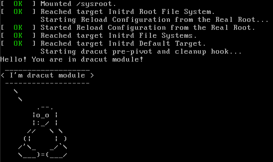

# Домашнее задание 7. Работа с загрузчиком.
## 1. Попасть в систему без пароля несколькими способами. 
### 1.1. Способ 1. init=/bin/sh
- В начале загрузки дойдя до меню GRUB, нажимаем клавишу `e` - входим в экран редактирования настроек загрузчика. 
- В параметрах ядра (в строке начинающейся с **linux16**) в конец добавляем `init=/bin/sh`, удаляем `console=tty0 console=ttyS0,115200n8`. Это изменит загрузку `systemd` на загрузку шелла.
- Загружаемся нажатием `ctrl+x`. Попадаем в нашу систему и сразу в командную строку.
- Переонтируем корневую ФС на запись `mount -o remount,rw /`
- Меняем пароль **root** командой `passwd`
- Перезагружаемся
### 1.2. Способ 2. rd.break 
- В начале загрузки дойдя до меню GRUB, нажимаем клавишу `e` - входим в экран редактирования настроек загрузчика. 
- В параметрах ядра (в строке начинающейся с **linux16**) в конец добавляем `rd.break`, удаляем `console=tty0 console=ttyS0,115200n8`.
- Загружаемся нажатием `ctrl+x`. Попадаем в **initramfs**.
- Корневая файловая система теперь в `/sysroot`. Переонтируем ее на запись.`mount -o remount,rw /sysroot`
- Меняем root каталог командой `chroot /sysroot`
- Меняем пароль **root** командой `passwd`
- Перезагружаемся
### 1.3. Способ 3. rw init=/sysroot/bin/sh
 - В начале загрузки дойдя до меню GRUB, нажимаем клавишу `e` - входим в экран редактирования настроек загрузчика. 
- В параметрах ядра (в строке начинающейся с **linux16**) вместо `ro` добавляем `rw init=/sysroot/bin/sh`, удаляем `console=tty0 console=ttyS0,115200n8`.
- Загружаемся нажатием `ctrl+x`. Попадаем в нашу систему и сразу в командную строку, корень на этот раз примонтирован на запись.
- Однако придется все равно менять root каталог командой `chroot /sysroot` (у меня не атоматом не поменялся)
- Меняем пароль **root** командой `passwd`
- Перезагружаемся
## 2. Установить систему с LVM, после чего переименовать VG.
### 2.1. Допустим мы имеет следующую конфигурацию LVM:
```
[root@lvm ~]# pvs
  PV         VG         Fmt  Attr PSize   PFree
  /dev/sda3  VolGroup00 lvm2 a--  <38.97g    0 
[root@lvm ~]# vgs
  VG         #PV #LV #SN Attr   VSize   VFree
  VolGroup00   1   2   0 wz--n- <38.97g    0 
[root@lvm ~]# lvs
  LV       VG         Attr       LSize   Pool Origin Data%  Meta%  Move Log Cpy%Sync Convert
  LogVol00 VolGroup00 -wi-ao---- <37.47g                                                    
  LogVol01 VolGroup00 -wi-ao----   1.50g                 
```
### 2.2. Переименуем VG:
```
[root@lvm ~]# vgrename VolGroup00 store
  Volume group "VolGroup00" successfully renamed to "store"
```

### 2.3. Вносим соответствующие измения в файлы **/etc/fstab**, **/etc/default/grub**, **/boot/grub2/grub.cfg**
- **/etc/fstab**:
```
#
#
# /etc/fstab
# Created by anaconda on Sat May 12 18:50:26 2018
#
# Accessible filesystems, by reference, are maintained under '/dev/disk'
# See man pages fstab(5), findfs(8), mount(8) and/or blkid(8) for more info
#
/dev/mapper/store-LogVol00 /                       xfs     defaults        0 0
UUID=b60e9498-0baa-4d9f-90aa-069048217fee /boot                   xfs     defaults        0 0
/dev/mapper/store-LogVol01 swap                    swap    defaults        0 0
#VAGRANT-BEGIN
# The contents below are automatically generated by Vagrant. Do not modify.
#VAGRANT-END

```
- **/etc/default/grub**:
```
GRUB_TIMEOUT=1
GRUB_DISTRIBUTOR="$(sed 's, release .*$,,g' /etc/system-release)"
GRUB_DEFAULT=saved
GRUB_DISABLE_SUBMENU=true
GRUB_TERMINAL_OUTPUT="console"
GRUB_CMDLINE_LINUX="no_timer_check console=tty0 console=ttyS0,115200n8 net.ifnames=0 biosdevname=0 elevator=noop crashkernel=auto rd.lvm.lv=store/LogVol00 rd.lvm.lv=store/LogVol01 rhgb quiet"
GRUB_DISABLE_RECOVERY="true"
```
- **/boot/grub2/grub.cfg**
```
	linux16 /vmlinuz-3.10.0-862.2.3.el7.x86_64 root=/dev/mapper/store-LogVol00 ro no_timer_check console=tty0 console=ttyS0,115200n8 net.ifnames=0 biosdevname=0 elevator=noop crashkernel=auto rd.lvm.lv=store/LogVol00 rd.lvm.lv=store/LogVol01 rhgb quiet 
	initrd16 /initramfs-3.10.0-862.2.3.el7.x86_64.img
```
### 2.4. Пересоздаем **iniramfs**

`dracut --force -v`

### 2.5. Перезагружаеся и смотри что получилось
```
[root@lvm ~]# pvs
  PV         VG    Fmt  Attr PSize   PFree
  /dev/sda3  store lvm2 a--  <38.97g    0 
[root@lvm ~]# vgs
  VG    #PV #LV #SN Attr   VSize   VFree
  store   1   2   0 wz--n- <38.97g    0 
[root@lvm ~]# lvs
  LV       VG    Attr       LSize   Pool Origin Data%  Meta%  Move Log Cpy%Sync Convert
  LogVol00 store -wi-ao---- <37.47g                                                    
  LogVol01 store -wi-ao----   1.50g         
```
## 3. Добавить модуль в initrd
### 3.1. Coздаем каталог для нашего модуля
```
[root@localhost ~]# mkdir /usr/lib/dracut/modules.d/01test
```
### 3.2. Помещаем в кататог файлы **module-setup.sh** и **test.sh**
 - **module-setup.sh**
 ```
 #!/bin/bash

check() {
    return 0
}

depends() {
    return 0
}

install() {
    inst_hook cleanup 00 "${moddir}/test.sh"
}
```
- **test.sh**
```
#!/bin/bash

exec 0<>/dev/console 1<>/dev/console 2<>/dev/console
cat <<'msgend'
Hello! You are in dracut module!
 ___________________
< I'm dracut module >
 -------------------
   \
    \
        .--.
       |o_o |
       |:_/ |
      //   \ \
     (|     | )
    /'\_   _/`\
    \___)=(___/
msgend
sleep 10
echo " continuing...."
```
### 3.3. Устанавливаем файлам права на запуск
```
[root@localhost 01test]# chmod +x module-setup.sh 
[root@localhost 01test]# chmod +x test.sh 
```
### 3.4. Пересобираем **initramfs**
```
[root@localhost 01test]# dracut -f -v
```
Проверяем, что наш модуль добавился
```
[root@localhost 01test]# lsinitrd -m /boot/initramfs-$(uname -r).img | grep test
test
```
### 3.5. Перезагружаемся и смотрим, что получилось. Если требуется, то удалить параметры ядра `console=tty0`, `console=ttyS0,115200n8` `rhgb`, `quiet`.



## 4(*). Сконфигурировать систему без отдельного раздела с /boot, а только с LVM
### 4.1. Создаем раздел файловую систему на LVM. 
```
[root@otuslinux ~]# parted -s /dev/sdb mklabel msdos
```
```
[root@otuslinux ~]# parted -s /dev/sdb mkpart primary ext4 0% 100%
```
PV необходимо инициализировать с параметром  --bootloaderareasize 1m, иначе GRUB не устанавливается.
```
[root@otuslinux ~]# pvcreate /dev/sdb1 --bootloaderareasize 1M
```
```
[root@otuslinux ~]# vgcreate store /dev/sdb1 
```
```
[root@otuslinux ~]# lvcreate -n root -l 100%FREE store
```
```
[root@otuslinux ~]# mkfs.ext4 /dev/mapper/store-root
```
```
[root@otuslinux ~]# lsblk
NAME           MAJ:MIN RM  SIZE RO TYPE MOUNTPOINT
sda              8:0    0   10G  0 disk 
└─sda1           8:1    0   10G  0 part /
sdb              8:16   0  9.8G  0 disk 
└─sdb1           8:17   0  9.8G  0 part 
  └─store-root 253:0    0  9.8G  0 lvm  
```
### 4.2. Монтируем новый раздел в /mnt 
```
[root@otuslinux ~]# mount /dev/mapper/store-root /mnt
```
### 4.3. Копируем существуюшую систему
```
[root@otuslinux ~]# rsync -a -x / /mnt
```
### 4.4. Монтируем необходимые каталоги **/dev**, **/proc**, **/sys**, **/run**
```
[root@otuslinux ~]# for i in dev proc run sys;do mount --bind /$i /mnt/$i; done
```
### 4.5. Меняет корневой каталог 
```
chroot /mnt
[root@otuslinux /]# 
```
### 4.6. Устанавливаем модифицированный GRUB (хотя у меня работает со штатным проблем не возникло)
- Добавлям репозиторий
```
[root@otuslinux /]# yum-config-manager --add-repo=https://yum.rumyantsev.com/centos/7/x86_64/
```
- Устанавливаем GRUB из нового репозитория
```
[root@otuslinux /]# sudo yum --enablerepo=yum.rumyantsev.com_centos_7_x86_64_ install grub2
```
### 4.7. Вносим измения в файлы **/etc/fstab**, **/etc/default/grub**, 
- **/etc/fstab**
```
[root@otuslinux /]# blkid
/dev/sdb1: UUID="65swlt-bDW0-eP0D-fWDw-aiDY-JN9y-nZU5Y2" TYPE="LVM2_member" 
/dev/sda1: UUID="1c419d6c-5064-4a2b-953c-05b2c67edb15" TYPE="xfs" 
/dev/mapper/store-root: UUID="a71deb70-9d05-446e-84d0-e1fbb9f5920a" TYPE="ext4" 
[root@otuslinux /]# cat /etc/fstab 

#
# /etc/fstab
# Created by anaconda on Thu Apr 30 22:04:55 2020
#
# Accessible filesystems, by reference, are maintained under '/dev/disk'
# See man pages fstab(5), findfs(8), mount(8) and/or blkid(8) for more info
#
UUID=a71deb70-9d05-446e-84d0-e1fbb9f5920a /                       ext4     defaults        0 0
/swapfile none swap defaults 0 0
#VAGRANT-BEGIN
# The contents below are automatically generated by Vagrant. Do not modify.
#VAGRANT-END
```
- **/etc/default/grub** 

В файле **/etc/default/grub** в параметр **GRUB_CMDLINE_LINUX** добавляем `rd.lvm.lv=store/root`. Это нужно для автоопределения lvm[^1]. Иногда определяется автоматически. В centos/7 определяется автоматически, в centos/8 - нет.

### 4.8. Устанавливаем GRUB
```
[root@otuslinux /]# grub2-mkconfig -o /boot/grub2/grub.cfg
```
```
[root@otuslinux /]# grub2-install /dev/sdb
```
### 4.9 Пересобираем **initramfs**
```
[root@otuslinux /]# dracut -f -v
```
### 4.10 Отключам SELinux в файле `/etc/selinux/config` или делаем `touch /.autorelabel` и перезагружаемся. Выбираем при загрузке через `F12` новый диск. Смотрим результат
```
root@otuslinux:~[root@otuslinux ~]# lsblk
NAME           MAJ:MIN RM  SIZE RO TYPE MOUNTPOINT
sda              8:0    0   40G  0 disk 
└─sda1           8:1    0   40G  0 part 
sdb              8:16   0  9.8G  0 disk 
└─sdb1           8:17   0  9.8G  0 part 
  └─store-root 253:0    0  9.8G  0 lvm  /
```

[^1]: https://man7.org/linux/man-pages/man7/dracut.cmdline.7.html


